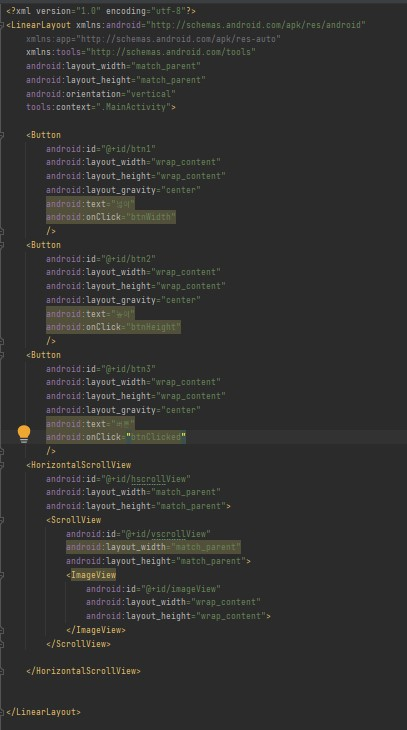

# 2주차 (2022-03-15)

- 안드로이드 스튜디오 설치 && 깃허브 가입 및 저장소 생성
</img>

## 3주차 과제

</img>
</img>
</img>

## 5주차 과제

</img>
</img>
</img>
</img>

## 6주차 과제
</img>
</img>
</img>
</img>
</img>
</img>

## 10주차 과제
</img>
</img>
</img>
</img>
</img>
</img>
</img>

## 11주차 과제
</img>
</img>
